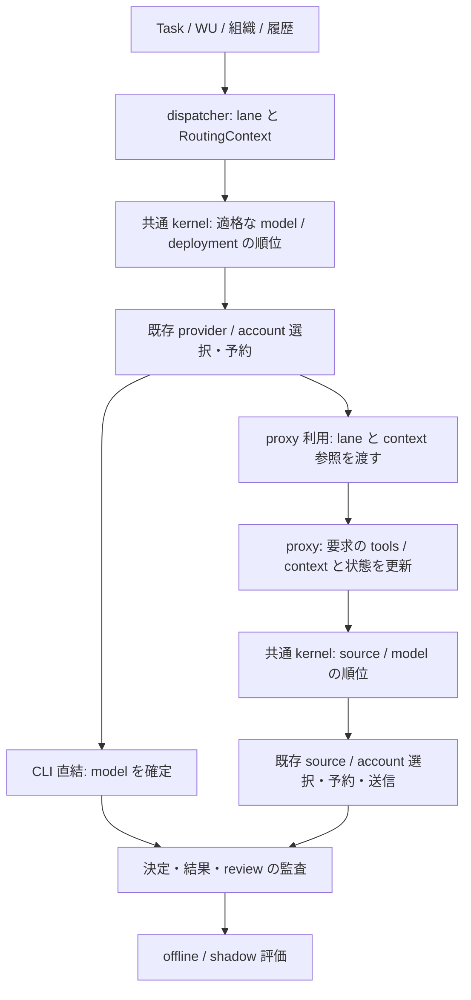

# 多目的モデルルーティング: 共通 kernel と Phase 1〜5 の実装契約

- 日付: 2026-10-04
- 状態: **設計を記録**。実装済みの範囲は末尾の付記（Phase 1・Phase 2）を正とする。research 段の人レビューへ渡す architecture ADR。以下の型・設定・API・試験名は、既存と明記したもの以外は実装予定である。
- 回答済みの決定: **shadow-exec = opt-in-capped**（実呼出しは既定 off、対象と一日上限を設定）。**estimator-scope = adapter-plus-routellm**（Phase 5 は汎用 sidecar estimator adapter に加え、RouteLLM 型 classifier を実 sidecar として動かす起動・停止手順、license・依存・CPU/GPU 要件の記録、上限付き shadow 評価まで。本番切り替えを含めない）。weights の利用条件は **[needs-human] `routellm-weights-use`**（§7.3、Phase 5 前）として分離し、この回答済みの範囲を縮小しない。
- 根拠: [棚卸し](../progress/2026-10-04-multi-objective-routing/inventory.md)、[upstream-oss 調査](../progress/2026-10-04-multi-objective-routing/upstream-oss.md)、[進捗](../progress/2026-10-04-multi-objective-routing.md)。調査原本は `celeris-wu/01M44H0SRV70E32AQ6C5N37MSK/{inventory,upstream-oss}` の同名ファイル。着手 HEAD `aa44fe420e25` には両方を含む。
- 拡張元: [ADR-0069](0069-routing-four-layers.md) の Model / Review 層、[ADR-0132](0132-provider-llm-source-split-and-cheap-qwen.md) の adapter/source 分離と cheap Qwen 制限。Ownership / Harness を選び直す機能ではない。

## 1. 現状と決定の要点

同じモデルを複数 subscription・API・self-host から使えるようになると、tier→model の固定写像と account 残量だけでは、品質・待ち時間・枠の枯渇・ローカル資源を比較できない。一方、要求ごとの外部 router に担当や lane の決定を委ねると、組織上限・受け入れ条件・再試行履歴が抜け落ちる。

そこで、6 要素（ModelProfile、SourceState/DeploymentProfile、RoutingPolicy、RoutingContext、QualityEstimator、Policy Optimizer）を値でつなぐ。オンラインの **Policy Optimizer は決定的な選択関数**である。別の offline evaluator がログから重み等の改善案を出すが、自動学習・自動適用は行わない。棚卸し §6 で仮に「Policy Optimizer」を offline 側だけに使った呼称は、この ADR で区別し直す。

### 1.1 cheap-local-first の取り込み境界

調査基点 `c8612886` と本 task の HEAD には cheap-local-first が無いが、確認時の `main` は **`33774b6ae894c9c3727842cf9337266c64822c18`** で、その修正を含む。task `01M44G5KKF8VJ0ARJH8J843T7D` の進捗、ADR-0132 付記 L1〜L8、diff を `git show 33774b6a:…` で確認した。本 ADR だけの branch へコードは取り込まない。Phase 1 着手時に親計画側で main のこの変更を統合してから実装する（cherry-pick で二重に作らない）。

既存の `Config::local_cheap_providers`、`select_provider_for(…, cos, prefer_local)`、`set_local_providers` / `set_local_provider_probe`、`[execution] cheap_local_first=true` と `LaneResolution.selection` を再利用する。cheap worker の新規選択は適格なローカル行を先に見る。満杯・不通なら pool に倒し、不通行を最後の fallback に復活させない。reviewer・CoS・sticky session・standard/frontier の既存優先関係を維持する。paperqa / local-deep-research / langmem を「ローカル枠」と判定する対象へ勝手に追加しない。

`local_preferred/local_full/local_down/pool/fallback/sticky` は **provider を選んだ理由**として残す。後述の model/source score の理由で上書きしない。既存 probe の「観測不能は生存扱い」と、明示的に要求する privacy/locality の「不明は許可しない」は別である。トンネルの URL が localhost というだけで実計算場所を local と推定しない。

## 2. kernel の置き場所と 2 つの決定点

`crates/task-core/src/model_router/` を新設し、`profiles`、`context`、`policy`、`estimator`、`optimizer`、`trace` に純粋型・検証・正規化・score 関数を置く。`task_core::routing::RoutingPolicy` は harness 用の既存 trait なので拡張しない。新型の完全名は `task_core::model_router::RoutingPolicy` とする。`ModelPolicy`（task→lane）、`ProviderPolicy`（adapter 実行枠）、`ShadowClassifier`（lane 分類の予約）とも区別する。

kernel は時計、ネットワーク、DB、LLM、乱数を呼ばない。`now`、観測 snapshot、乱数代わりの安定した sampling key、推定結果を呼び手から値で渡す。`task-core` から `llm-proxy` / `task-dispatch` への依存を作らない。両者が同じ kernel を直接使う。既存 `llm-proxy → task-dispatch::accounts` の依存は残し、account の評価式を複製しない。



| 境界 | 決めるもの・責務 | 決めないもの |
| --- | --- | --- |
| dispatcher（run 単位） | ADR-0069 の規則・人/system 指定・組織上限・retry による lane、run role、provider の能力と空き。CLI 直結は実 model/deployment まで解決。proxy 経由は必要能力を満たす source が存在する実行枠を選び、確定前の見通しとして記録 | proxy 内の account を予約しない。proxy で使われた model を起動時に断定しない |
| proxy（LLM request 単位） | 受け取った lane 内で、実際の入力長・要求 tools と新しい SourceState を使い model/source/account と fallback 列を決定。CLI 直結はここを通らない | lane、担当、harness、task の受け入れ結果を変更しない。`celeris/frontier` を Qwen に落とさない |
| I/O 層 | dispatcher は既存 provider 選択と account book、proxy は既存 selection/credentials/source sender を使う。snapshot 後の capacity 競合はここで予約を取り直す | estimator の返す source 指定を無条件に実行しない |

Phase 3 で daemon が `RoutingContext` を run_id に結び、期限付きの opaque な `context_ref` を発行する。`task-worker` は adapter の proxy 用設定に `x-celeris-routing-context` を渡す。proxy は daemon が登録した参照だけを信頼し、本文の org/priority/privacy 自己申告を採らない。この header と内部 run ID は upstream に転送しない。終了後も in-flight 要求が終わるまで参照を保持し、その後失効する。無効・期限切れ参照は 400、参照なしの外部利用は `origin=standalone` の最小 context（lane・要求 tools・入力長とサーバの既定制約）で動く。

header を渡せない adapter は `context_transport=unsupported` と監査する。明示の組織 privacy 制約を持つ enforce run ではその経路を不適格にする。legacy run は従来どおり動くが、task の context が proxy に届いたとは表示しない。依存を逆流させず、daemon bootstrap で登録/read の interface を配線する。

## 3. 6 要素のデータ契約

### 3.1 ModelProfile: モデル identity と静的能力

`ModelProfile { id, revision, family, capabilities, context_limits, quality, pricing, provenance }`。`id` は source に依存しない安定キー、`revision` は weight/release の識別子。複数 source が同じ profile を参照する。単なる同名 alias は統合しない。quantization や checkpoint が品質を変えるなら別 profile、source ごとの wire model 名は DeploymentProfile に置く。

- `capabilities`: tools/function calling、structured output、vision、streaming、対応 reasoning effort。値は `supported/unsupported/unknown` の 3 値。`context_limits` は input/output/total の token 上限（欠測は None）。必要能力と予約 output を含む context が不明なら enforce の候補にしない。
- `quality`: domain/task kind 別の品質指数（0〜1）、評価版、標本数、出典。確率や保証値とは呼ばない。未評価は None。heuristic は task metadata の難しさとの適合度を決定的な表で補正し、その表の版を残す。
- `pricing`: 通貨 USD と input/cached-input/output の **1M token 当たり**参考価格、取得日・出典・欠測。deployment 価格 override を優先する。subscription の固定料金や GPU 混雑をここへ混ぜない。モデル台帳の正本は Celeris 設定から正規化した catalog とその保存 snapshot。

### 3.2 DeploymentProfile と SourceState: 静的供給情報と動的観測

`DeploymentProfile { id, source_ref, model_profile_id, upstream_model, adapter_constraints, billing, locality, privacy, limits, price_override }`。既存 `llm_source` を参照し資格情報は複写しない。`billing` は subscription / metered_api / self_hosted。locality は実計算 host/region/trust zone と外部ネットワーク要否。`limits` は deployment の同時実行・RPM/TPM・許可 lane（Qwen は cheap のみ）。複数モデルが同じ GPU を使う場合は `resource_group_id` を共有する。

`SourceState { deployment_id, observed_at, expires_at, availability, health, latency, concurrency, rate_limits, quota_windows, queue, gpu, provenance }` を I/O 層が合成する。

| 観測 | 必須の意味 |
| --- | --- |
| availability / health | enabled、到達性 unknown/up/down、cooldown_until、circuit closed/open/half_open と probe 数。disabled・down・cooldown・open は除外 |
| latency | TTFT と完了時間の p50/p95、集計窓、標本数。未観測は None（ゼロではない） |
| concurrency / rate_limits | limit/in_use と観測元の scope（provider、CLI account、proxy account、resource group）。RPM/TPM の remaining/reset_at、予約分。既存の異なる in-use 枠を足して二重計上しない |
| quota_windows | account ごとに window_id、単位（fraction/tokens/requests）、remaining/limit、reset_at、measured/estimated、freshness。5h/7d 等を配列で保持。fraction と token を換算根拠なしに混ぜない |
| queue / gpu | queue depth/limit、queue wait、GPU utilization 0〜1、VRAM used/total、測定時刻。probe で到達したことから負荷ゼロを推定しない |

`AccountBook`、relay probe、`SourceView`、provider capacity が入力の正本で、新しい cooldown/残量台帳を二重に作らない。観測期限切れは unknown、reset 時刻経過だけでは quota 満タンを捏造せず再観測する。CLI/proxy の in-use は現行どおり独立、共有 GPU の総量制約だけは daemon 内の resource group 予約で直結と proxy の両方に適用する。外部クライアントの負荷は観測値として扱い予約と区別する。直結 run の resource group は dispatcher が run 開始から終了まで保守的に予約し、proxy 経由の run は dispatcher で GPU を予約せず、proxy が各要求の送信から stream 終了まで予約する。同じ処理で両方の枠を消費しない。

### 3.3 RoutingPolicy: lane の SLO と制約

`RoutingPolicy { version, lane, objective, min_quality, weights, normalization, constraints, fallback, escalation, local_preference }`。以下は **enforce 用初期既定値**であり benchmark 済みの閾値ではない。`legacy` は旧写像を維持する。policy の採用・変更は人の設定変更として版を更新する。

| lane | objective | min_quality | weights（quality, cost, latency, pressure） |
| --- | --- | --- | --- |
| frontier | quality-first | 0.85 | 0.70, 0.10, 0.15, 0.05 |
| standard | balanced | 0.65 | 0.45, 0.25, 0.20, 0.10 |
| cheap | resource-first | 0.40 | 0.15, 0.45, 0.15, 0.25 |

weights は非負・有限で和 1、min_quality は [0,1]、正規化の参照値は正を必須にする。quality-first は品質指数を第一ソートキー、他は weighted score を第一キーとする。cheap worker の既存 local-first 有効時は、hard constraints と min_quality を満たすローカル候補群を第一の優先群とし、その中を score で比較する。source 側の `prefer_free` も同じ適格性検査後の優先群として使う。dispatcher の local-first を切った場合はその優先群を外すが、proxy の `prefer_free` は独立した設定として残る。両方を切った経路は score のみになる。価格が高いから quality floor を下げることはしない。

constraints は allowed deployments/sources、min_quality、context/output 上限、required tools、privacy（外部送信可否・保持条件）、locality、最大支出・待ち時間。組織→task の制約は交わり（上限は min、品質下限は max）。明示 lane は lane 規則の選択には勝つが privacy・能力・認証・供給上限の例外ではない。Qwen cheap 制限は名前の prefix でなく deployment の許可 lane に固定する。

### 3.4 RoutingContext: task と要求の入力 snapshot

`RoutingContext { version, origin, task_id?, work_unit_id?, run_id?, org_node?, role, harness, task_kind, phase?, acceptance, required_tools, environment, estimated_tokens, attempts, priority, constraints, provenance }`。

- role は worker/reviewer/planner/cos 等。phase は計画段 key と作業種別（実装・調査・統合等）。acceptance は command/artifact/reviewer/human の件数・検証可能性・安定 ID/hash。生の command、secret、本文は feature event に入れない。
- environment は実行場所、sandbox、利用可能な tool の能力 ID、ネットワーク許可、必要 modality。required tools は harness が要求する protocol と実行環境の両方を照合する。
- estimated_tokens は input/output reserve、推定方法/版と不確実性。proxy は実 payload から再推定し大きい側を採る。context budget は input + output reserve + safety margin と total 上限を比較する。
- attempts は run/WU ごとの試行数、review/検査の失敗分類と criterion ID、供給側失敗、直前 lane、session resume 情報。priority はスケジューラの出自付き値で、品質制約を緩める理由にはしない。未知の値を低リスクと同一視しない。

### 3.5 QualityEstimator: 品質の助言だけ

以下を純粋 kernel の trait 境界とする（概念シグネチャ）。

```rust
trait QualityEstimator: Send + Sync {
    fn descriptor(&self) -> EstimatorDescriptor;
    fn estimate(&self, model: &ModelProfile, context: &RoutingContext)
        -> QualityEstimate;
}
// descriptor: id/version, maturity, external_dependencies, needs_network,
//             needs_prompt, supported_domains
// estimate: index: Option<f64>, confidence: Option<f64>, reasons, feature_version
```

既定の `HeuristicEstimator` は profile の評価表と context の適合度を使うだけで I/O をしない。出力は有限な [0,1]、未知は None。品質未知の候補は enforce の min_quality を通らない。最終 lane、source、account を返す API を設けず、能力・privacy の除外を estimator に覆させない。

Phase 5 の HTTP は kernel trait 内で同期実行しない。`llm-proxy` の sidecar adapter が timeout 付きで estimate batch を取得し、検証済みの snapshot を返す trait 実装を shadow kernel に渡す。CLI 直結 run の評価も daemon の評価キューへ出し、dispatcher tick から HTTP/LLM を呼ばない。sidecar が落ちても primary の heuristic 結果は不変。estimator の自己申告は必要条件であり、実際の送信先・network 許可は daemon 設定で制限する。

### 3.6 Policy Optimizer: hard constraints → candidates → estimate → score → 解決

1. **hard constraints**: lane/明示モデル・source 制限、adapter/harness 適合、privacy/locality、能力/context、enabled/auth/health、既知の枯渇・capacity を検証する。除外理由を全て記録する。availability unknown は既存互換の扱いを選べるが、privacy/capability unknown は enforce で通さない。
2. **candidates**: `(model_profile_id, deployment_id, eligible_provider_ids)` を列挙し、同一 deployment を重複させない。account は既存評価関数からの適格性・headroom snapshot のみを使い、ここでは予約しない。sticky は hard constraints 内でまず試し、使えない理由を残す。
3. **estimate**: heuristic（Phase 5 の比較側だけ sidecar）で候補ごとの品質指数と根拠を得る。`min_quality` 未満/unknown を除外する。
4. **score/selection**: §4 の成分、優先群、安定 tie-break で順位を作る。fallback 候補も同じ制約を満たすものだけ。候補ゼロは `unroutable`（静的制約）または `defer`（供給回復待ち）であり、任意の安いモデルへ送らない。
5. **既存 account/source 選択**: 許された順位群を既存 `select_provider_for` / proxy `rank_*` に渡し、適格な account の残量・in-use・id の既存規則で確定/予約する。既存 selector が候補外へ fallback できないよう allowlist を渡す。予約競合時は snapshot を更新し 1 回再計算、それでも満杯なら既存待機経路へ戻す。score と実際の解決が違えば `reservation_conflict` と両 ID を記録する。

モデルが同じでも deployment の価格・残量・待ち時間で順位は異なる。確定キーは優先群 → frontier の品質（他 lane は省略）→ weighted score 降順 → cost 昇順 → 設定順 → model/deployment ID の辞書順。account の tie-break はその後の既存処理。浮動小数は比較前に 1e-6 単位の整数へ量子化し、NaN/inf は設定エラー/推定拒否とする。

## 4. effective cost と resource pressure

現金支出と枠の機会費用を同一の usage に書かない。`CostEstimate { cash_usd?, subscription_shadow_usd?, self_host_resource_usd?, effective_usd?, pressure, assumptions }` とし、次を推定する。推定値と実測値の各欄を分け、欠測は None のまま監査する。

- API: `cash = (uncached_in × input_price + cached_in × cached_price + out × output_price) / 1e6`。cache 量不明は全 input を uncached とする。価格未登録を $0 にしない。
- subscription: 一呼出しの cash marginal は 0（固定月額は別の会計）。各窓 j について `u_j = estimated_consumption_j / remaining_j`、`h_j = clamp((reset_at_j-now)/window_duration_j, 0, 1)`、`shadow = max_j(reserve_value_usd_j × u_j × h_j)`。同じ呼出しを制約する複数窓は和で二重請求せず max。reset まで長く残量が少ないほど高くなる。消費単位を推定できない窓は shadow unknown、確実な枯渇は score 前に除外。未知残量を無限 headroom としない。
- self-host: `resource = gpu_seconds_estimate × configured_usd_per_gpu_second + queue_wait_seconds × configured_usd_per_wait_second`。これは API 請求ではなく予約機会費用。測定/設定が無ければ unknown。`pressure = max(in_use/limit, queue_depth/queue_limit, gpu_utilization, vram_used/total)` を既知成分から [0,1] に clamp する。GPU utilization=1 だけでは即不適格にせず、concurrency/queue の hard limit と区別する。
- `effective = cash + shadow + resource`（billing に無関係な成分は 0、必要成分の欠測は unknown）。pressure の weight は飽和への回避バイアスであり追加のドル額ではない。

`C = min(effective_usd / policy.cost_reference_usd, 1)`、`L = min(estimated_latency_ms / policy.latency_reference_ms, 1)`、`P = pressure` とする。`score = wq × Q - wc × C - wl × L - wp × P`。参照値は設定に固定し候補集合の min/max を使わない（候補追加だけで尺度が変わらない）。quota 消費/remaining、価格、時間、各 limit は非負・有限（除算の分母は正）を検証する。pressure の観測が全て欠測なら None とする。未知の C/L/P は順位用に保守値 1 を使い unknown flag を残す。hard な費用/latency 上限がある場合の unknown は除外する。品質の unknown は補完せず min_quality 不合格とする。

例: 5h 窓の remaining が 0.5→0.1、他の値一定なら shadow は 5 倍。reset まで半分なら shadow は半分。GPU queue が増えた self-host は resource と P が上がる。これらは同じ固定入力で再現できる関数の試験にする。課金の実測 USD、tokens、wall_ms、retry 数を effective_usd で書き換えない。

## 5. fallback と軌跡 escalation

proxy の **同一要求内 fallback** と dispatcher の **run 間 escalation** を分離する。proxy は stream の最初の byte を返す前だけ次候補へ送れる。開始後の失敗は caller に返す。401/429 と既存 account cooldown を使い、Phase 2 では例外分類別 retry 上限と deployment の closed/open/half_open を補う。half_open の試し打ちは同時 1 件、状態遷移・deadline は偽時計で試験する。既存の no-source 再走査・Retry-After を維持し、retry 総上限を超えない。

dispatcher は `retry_policy::attempt_history` / `EscalationPolicy` を拡張する。review/acceptance 検査の同一 lane 連続失敗 2 回で cheap→standard→frontier と 1 段ずつ上げる。既定 total attempts は `min(4, max_retries+1, profile.max_attempts)`、組織天井・WU の task lane 上限を超えない。人/system 明示 lane は上げない。SupplySide/予算切れ/コメント割り込み/キャンセルを低品質の証拠としない。`reopen` は既存規約どおり履歴を区切り、同じ event の再投影で二重に数えない。`Stop` は escalation の停止であり、task 終端は従来の状態機械が決める。

Phase 3 で criterion ID と run/WU の軌跡を context に付ける。quality estimator が低いと述べただけで task を失敗させず、合否は reviewer/決定的検査に置く。escalation 後は新 lane の floor で再計算する。

ADR-0069 の残量による `select_tier` 降格は **legacy/shadow の primary に維持**する。enforce では同じ lane の別 deployment を先に試し、無ければ defer する。残量のために floor を下げる暗黙降格を廃止する（この点が明示的な動作変更）。これにより escalation と quota 降格の往復を防ぐ。移行時には `requested_lane/legacy_effective_lane/selected_lane/quota_reason` を区別して比較する。

## 6. 決定・feature・reward の event schema

`RoutingDecided` と既存 `resolution.selection` は残す。Phase 1 で `RoutingRecord.optimizer: Option<RoutingTraceV1>` を追加する。欠落する旧 event は従来どおり decode/replay できる。以下の schema version は lane-policy の版とは独立である。

| record/event（予定 wire 名） | version 1 の内容と帰属 |
| --- | --- |
| `RoutingTraceV1` | `decision_id, parent_decision_id?, task_id?, work_unit_id?, run_id?, request_id?, stage(dispatch/proxy), mode, policy_version, catalog_version, feature_version, estimator_version, snapshot_id, observed_at, requested_lane, selected_lane, candidates[], selected?, fallback_order[], reasons[]`。candidate は model/deployment/provider の ID、除外 reason code、品質・confidence、cash/shadow/resource/effective、Q/C/L/P と score、観測の鮮度を持つ |
| `routing_features_recorded` | `decision_id, context_version, features, provenance, missing_fields[]`。§3.4 の本文を除いた特徴 snapshot。run の時点と proxy の更新時点を区別し、後の review 結果を当時の feature に混ぜない |
| `routing_request_decided` | proxy の trace、run 側 decision を親とする ID、実際に試した source/model/account の参照、fallback 原因。standalone は task/run ID なし。従来の `llm_proxy_requests` と request_id で結合する |
| `routing_outcome_recorded` | `outcome_id, decision_id, run_id?, request_id?, evaluation_version, supersedes?, acceptance_passed?, review_passed?, failed_criterion_ids[], failure_class?, cash_usd?, tokens?, wall_ms?, retries?, reward?`。未レビュー/中断は null、false や品質 0 とみなさない |
| `routing_shadow_evaluated` | `primary_decision_id, shadow_id, mode(decision/execute/estimator), policy/estimator_version, sampling_key, status(completed/failed/dropped), reason_code, candidate_decision?, tokens?, cost?, latency?, output_hash?, evaluation?`。primary の成功/失敗や attempts を変えない |

reason code は `privacy/locality/capability/context/quality_unknown/quality_below_min/disabled/health_down/cooldown/concurrency/rate_limit/quota_exhausted/stale_state/reservation_conflict` 等の安定値と、秘密を含まない説明に分ける。候補は設定上限 128、超過は読込エラーにする。feature は本文を持たず、trace は同じ policy/catalog/state/context snapshot から再生可能にする。設定 snapshot は secret を除き hash とともに保存する（credentials、endpoint の query、prompt、response は入れない）。

`task-core` の trace 型と event variant、store の索引を共通にする。proxy は `llm-proxy/log.rs` の記録に trace と parent ID を付け、daemon の event sink が task に相関できる要求のみ Task Event として append する。standalone は proxy log のみ。sink は request/decision ID で冪等に記録し、欠落時は `audit_incomplete` を見せ、推定で task に結び付けない。必要な additive DB migration は Phase 2/4 で番号の空きを再確認する（この ADR では番号を予約しない）。

reward の正本は生の outcome vector。offline 比較用 scalar の初期定義は `R = pass - 0.2*C_actual - 0.1*L_actual - 0.1*min(retries/4,1)`（pass は受け入れ合格 1、不合格 0）。ここで C_actual は実測 cash を同一の参照額で正規化、L_actual は実測時間を正規化する。未判定・必要な実測欠測は R=null。effective cost の予測と混ぜず、subscription の機会費用を評価するときは別名の推定 metric にする。後日の review 修正は新 outcome_id + supersedes を append し、単純上書きや二重学習をしない。proxy の個々の要求に run の合否を丸ごと複製せず、run に合算して評価する。

## 7. shadow / offline 評価と Phase 5 の sidecar

### 7.1 decision shadow と実行 shadow

`[model_routing].mode = legacy | shadow | enforce`、既定 legacy。shadow は primary を旧経路で選び、新 kernel の判断だけ比較する。enforce は人が選んだ対象のみ決定的 heuristic kernel を使う。Phase 4 の shadow 機能で追加呼出しの無い **decision shadow** を標準の比較方法とする。これは回答済みの **execution shadow は既定 off** と別設定である。

`[model_routing.shadow] execute=false`。有効化には対象 task kind/role/lane/source の allowlist（空なら対象なし）、sample_rate（[0,1]、decision_id の安定 hash で標本化）、`daily_max_requests`、`daily_max_tokens`、`daily_max_effective_usd`、`max_concurrency`、`max_queue_depth`、timeout_ms が全て必要。UTC 日界で計数し、開始前に output 上限込みの最悪消費を原子的に予約する。再起動・daemon handoff でも共有 DB の予約を読む。失敗/timeout 分も消費済みまたは予約上限として計上し、未知の費用は実行対象にしない。primary が先に実行枠を取り、shadow は残り枠だけ使い、primary の latency を待たせない。

shadow は要求のコピーだけを評価キューへ送る。primary と shadow が同じ非分離の resource group を使う場合は実行 shadow を対象外にし、primary の予約待ちが発生した時点でも未開始 shadow を drop する（すでに送信済みの推論時間をゼロにはできない）。tool call を実行せず、repo/DB/外部サービスへの副作用を発生させない。run を再実行したり reviewer を勝手に増やしたりしない。queue 満杯、上限、期限切れ、privacy 不一致は dropped と理由を記録する。出力保存は既定 SHA-256・tokens のみ。品質評価用の本文保持は対象と保持期間を別途明示した dataset export に限り、hash だけから品質を測れたとはしない。

### 7.2 offline dataset と受け入れ gate

入力は版付き JSONL + manifest（schema、policy/catalog/estimator hash、期間、抽出条件、masking、split、seed、欠測率）。task 単位で train/calibration/test を分け、同一 task の retry と review を別 split に漏らさない。実験は frozen snapshot と偽上流で再現できる。決定 shadow だけでは未選択モデルの品質は分からないため、反実仮想の品質/成功率を捏造しない。counterfactual coverage と unknown を report に明記する。

評価は acceptance 成功率・失敗 criterion、cash/effective cost 別集計、p50/p95 latency、retry/escalation、quota exhaustion、制約違反 0、source 比率、unknown/timeout/drop 率を必須とする。APGR、目標品質到達時の strong 呼出し率、非減少 cost-quality 凸包の AIQ、IBC は **比較可能な paired outcome がある場合だけ**算出する。API 呼出しだけの latency と task 完了時間、予測品質指数と実際の合否を別列にする。分母ゼロ/弱モデルより低い品質/非正の追加 cost は未定義として理由を返す。異なる指標を単一の改善率に混ぜない。

mode=enforce の対象拡大は自動で行わない。検証条件は同一 fixture で決定一致、hard constraint 違反 0、legacy primary 変更 0、shadow 上限超過 0。実データの性能優位はこの ADR で断定せず、sample size・信頼区間・欠測率と policy 版を人に渡す。Phase 5 は実 RouteLLM sidecar の起動・停止と上限付き shadow 評価を再現可能な証拠で確認する。品質向上は合格の必須条件にしないが、実 sidecar 未実行を接続可否の報告だけで完了にはしない。

### 7.3 汎用 sidecar adapter

設定 `[model_routing.estimator] kind="heuristic"` が primary の固定既定。`[model_routing.estimator.sidecar] enabled=false, shadow_only=true` とし、endpoint、protocol_version、estimator_id/version、timeout_ms、max_inflight、max_payload_bytes、send_prompt=false、network_allowlist を持つ。Phase 5 では `shadow_only=false` を設定エラーにし、sidecar に primary の選択権を渡さない。

HTTP `POST /estimate` version 1 の request は `request_id, context_features, candidates[{model_profile_id}], optional_prompt`。response は同じ request_id と `estimator_id/version, estimates[{model_profile_id,index?,confidence?,reasons}], dependencies`。未知/重複 ID、版不一致、値域外、NaN、サイズ超過、timeout は拒否して heuristic 比較へ戻す。prompt が必要でも send_prompt=false なら `prompt_required` として評価不能を記録する。privacy と locality は sidecar への送信と sidecar の外部依存の両方に適用する。

RouteLLM は strong/weak の 2 択の win-rate を返すため、汎用 adapter の裏の wrapper が対応する **2 model ID の相対推定**として返す。別 pair/未評価モデルへ汎化せず、Celeris の品質尺度へ校正できない場合は index=None として raw pair score を評価 metadata にだけ残す。`bert` が外部 embeddings 不要の第一候補。`mf/sw_ranking` は外部 embeddings を要し、send_prompt と外部送信の明示許可が無ければ拒否する。

回答済みの `adapter-plus-routellm` に従い、Phase 5 は汎用 adapter とともに **実 RouteLLM を呼ぶ wrapper、再現できる起動・停止手順、実 sidecar の上限付き shadow 評価 report** を成果に含める。wrapper は `/estimate` を実装し、classifier の score だけを取り出す。strong/weak の生成 API は呼ばない。通常 CI はネットワーク不要の偽 sidecar で protocol と異常系を検証するが、その合格だけでは Phase 5 完了にならない。実評価は明示 opt-in の別検査とし、未実行・skip・全件失敗は未完了にする。

**[needs-human] `routellm-weights-use`（needed_before: p5-estimator）:** [upstream-oss §5](../progress/2026-10-04-multi-objective-routing/upstream-oss.md) では第一候補 `routellm/bert_gpt4_augmented`（観測 revision `86237e3df400`）の license 宣言を確認できていない。人が利用条件の根拠を確認して当該 weights のローカル shadow 評価を認めるか、確認まで Phase 5 を保留するかを決める。コードの Apache-2.0 から weights の許諾を推定しない。回答までは weights を取得・使用せず、Phase 5 の必須評価を免除しない。この前提待ちは本 ADR 作成や Phase 1〜4 の完了を妨げない。承認後も weights は利用者が取得する手順とし、自動取得・同梱・再配布はしない。承認記録と確認した条件・対象 revision を手順と report に残す。

## 8. upstream の (a)/(b)/(c) 採否と追従

(a) は library/sidecar/data の再利用、(b) は小さな算法・評価指標の移植、(c) は設計を参考に独立実装。[upstream-oss §1〜5](../progress/2026-10-04-multi-objective-routing/upstream-oss.md) の 2026-10-04 観測（pin 済み commit）に基づく。以下は調査で確認した配布条件の記録であり、未確認 weights の許諾を推測で補わない。

| 要素 | (a)/(b) の代案と採らない理由 | 採用と根拠・追従コスト |
| --- | --- | --- |
| ModelProfile | (a) LiteLLM 台帳の全面 import、(b) 型の直写し。subscription/self-host の固有属性が不足 | **(c)**。[LiteLLM 台帳/schema](https://github.com/BerriAI/litellm/blob/1d52985d0310/model_prices_and_context_window.schema.json) の欄を参考にする。データは同梱せず追従は低。将来の任意 import は別変更 |
| SourceState / DeploymentProfile | (a) LiteLLM Python cache を daemon に入れる | **(c)**。[health state](https://github.com/BerriAI/litellm/blob/1d52985d0310/litellm/router_utils/health_state_cache.py) と SR reliability を参考に既存 AccountBook/probe を合成。追従は低 |
| RoutingPolicy | (a) SR decision engine、(b) Go の規則木。Envoy/FFI 依存と既存規則表に対する重複 | **(c)**。[SR decision](https://github.com/vllm-project/semantic-router/blob/04be09cdfed2/src/semantic-router/pkg/decision/engine.go) の層分離だけ採用。追従は低 |
| RoutingContext | (a) SR classifier、Arch-Router weights。prompt 分類と task metadata の不一致 | **(c)**。task/受け入れ/環境/履歴から抽出。model/依存更新を持ち込まず追従は低 |
| QualityEstimator | (b) RouteLLM の順位算法の移植では torch/embeddings の問題を解消しない | **既定 (c)、Phase 5 だけ (a)**。[RouteLLM routers](https://github.com/lm-sys/RouteLLM/blob/0b64fdafe049/routellm/routers/routers.py) を sidecar で shadow 評価。wrapper protocol・Python 依存の維持で追従は中 |
| 多目的 selection | (a) SR selector 全体、(b) hybrid/latency の移植は組み込みが重い | **(c)**。[SR selector](https://github.com/vllm-project/semantic-router/blob/04be09cdfed2/src/semantic-router/pkg/selection/selector.go) の説明可能な結果と [plano model_metrics](https://github.com/katanemo/plano/blob/72002a62d90a/crates/brightstaff/src/router/model_metrics.rs) の欠測扱いを参考にする。追従は低 |
| cooldown/retry/fallback | (a) LiteLLM router 置換、(b) SR circuit breaker。既存の送信・account 枠を重複させる | **(c)**。既存処理に分類別上限と half-open を補う。[SR circuit](https://github.com/vllm-project/semantic-router/blob/04be09cdfed2/src/semantic-router/pkg/fallback/circuit_breaker.go)。追従は低 |
| cascade/escalation | (a) AutoMix、(b) POMDP。要求単位の self-verification と run 軌跡が異なる | **(c)**。[AutoMix](https://github.com/automix-llm/automix/blob/531af3ee3c4e/automix/automix_methods.py) の段階昇格の考え方のみ。既存 EscalationPolicy を拡張。追従は低 |
| shadow dispatch | (a) SR plugin は Envoy ExtProc に依存 | **(c)**。[SR shadow](https://github.com/vllm-project/semantic-router/blob/04be09cdfed2/src/semantic-router/pkg/extproc/shadow_dispatch.go) の上限・非同期・結果分類を参考にする。追従は低 |
| offline 評価 | (a) RouterBench/RouteLLM 評価環境は古い巨大な依存・異なる領域の dataset を持つ | **(b)** は指標の数式の移植に限定。[APGR](https://github.com/lm-sys/RouteLLM/blob/0b64fdafe049/routellm/evals/evaluate.py)、[AIQ](https://github.com/withmartian/routerbench/blob/cc67d1008bd8/evaluation/AIQ.py)、AutoMix の IBC を Celeris の観測に適用。dataset は取り込まず、版固定で追従は低 |

ライセンスと保守の判断:

- SR `04be09cdfed2`、RouteLLM `0b64fdafe049`、plano `72002a62d90a`、AutoMix `531af3ee3c4e` のコードは Apache-2.0（調査した取り込み対象に NOTICE なし）。RouterBench `cc67d1008bd8` は MIT。LiteLLM `1d52985d0310` は enterprise 以外 MIT、`enterprise/` とそこへの symlink は独自商用条件で取り込み対象外。一次資料は各 pin の [SR LICENSE](https://github.com/vllm-project/semantic-router/blob/04be09cdfed2/LICENSE)、[RouteLLM LICENSE](https://github.com/lm-sys/RouteLLM/blob/0b64fdafe049/LICENSE)、[plano LICENSE](https://github.com/katanemo/plano/blob/72002a62d90a/LICENSE)、[AutoMix LICENSE](https://github.com/automix-llm/automix/blob/531af3ee3c4e/LICENSE)、[RouterBench LICENSE](https://github.com/withmartian/routerbench/blob/cc67d1008bd8/LICENSE)、[LiteLLM LICENSE](https://github.com/BerriAI/litellm/blob/1d52985d0310/LICENSE)。
- (c) の独立実装には上流コード/data をコピーしない。(b) は数式の意味を独立した Rust 実装にし、関数 doc comment に原典 URL・pin・式・相違を残す。逐語移植が必要になった場合は同じ変更で repo 根の `THIRD_PARTY_NOTICES.md` と `third-party-licenses/` に copyright/許諾文、Apache LICENSE と変更表示を加える。NOTICE のある別 revision を採るならその notice も保持する。Celeris 自身の LICENSE 未設定を第三者表示省略の根拠にしない。
- Arch-Router-1.5B の [weights LICENSE](https://huggingface.co/katanemo/Arch-Router-1.5B/blob/5b156890a91b/LICENSE) は Katanemo Community License（Apache ではない）。配布時の契約書・定型 notice・Built with DigitalOcean 表示等の条件があるため、今回の依存から外す。plano 本体の既定も Plano-Orchestrator に変わっている。
- RouteLLM の HF weights と RouterBench dataset は調査で license 宣言を確認できていない（HF revisions は調査 §5）。コードの Apache/MIT を weights/dataset に転用しない。§7.3 の [needs-human] が解消した後に別 process の実 RouteLLM sidecar で shadow 評価する。weights を自動取得・再配布せず、未確認を理由に Phase 5 の必須評価を任意化しない。sidecar のコードや image を将来同梱するならその配布物の notice も必要であり、「別 process だから免除」とは扱わない。
- 観測された直近 90 日の commit は SR 978、plano 35、LiteLLM 13,309。全体を fork/組み込みすると追従コストが高い。RouteLLM/AutoMix/RouterBench は調査時点で 2024 年以来 commit が無く、pin しても Python/torch/transformers の保守負担は残る。したがって全面置換を採らず、**(c) 8 項目、(b) 評価指標、(a) Phase 5 estimator** という調査の結論に従う。

## 9. 設定・API の互換と rollout

- `celeris/frontier|standard|cheap` と既存具体 model/source 指定、`claude/<tier>`、`gpt/<tier>`、`qwen/cheap` の wire 名を維持する。明示具体モデルは他のモデルへ黙って差し替えない。抽象 lane の最終 model は trace と既存 `x-celeris-source/account`、追加の `x-celeris-decision-id` で確認できる。
- `[[model_routing.models]]` / `[[model_routing.deployments]]` / `[model_routing.policies.<lane>]` を新設。古い `[llm_proxy.models]`、`tier_models`、provider の `llm_source` と欠落推定は互換 reader が catalog に正規化する。明示新設定が同じキーを上書きする場合は出自と警告、矛盾する identity/reference はエラー。旧 provider ID、account dir、資格情報、実行経路を自動改名/移動しない。旧設定で能力/品質が不足しても legacy は読めるが、enforce では不足の補完が必要。
- 既定 mode=legacy、shadow.execute=false、sidecar.enabled=false。旧 config 読込の警告はキー・出自・移行先だけで secret を出さず、同一版/キーにつき 1 回に集約する。legacy で現在の Qwen cheap 優先と fallback の期待値を保つ。enforce の適格性検査に通らない Qwen は理由を表示し、品質/能力制約を破って優先しない。
- API は既存 `GET /api/v1/tasks/{id}/routing` に optional な optimizer/request/shadow/outcome、`GET /api/v1/llm/sources` に deployment/state/cost の optional 欄を追加する。Phase 1 に読取専用 `GET /api/v1/llm/routing/catalog`（redacted profile/policy/version）を追加。providers API は実行枠のまま。旧欄は削除せず、一覧の重い trace は task routing 側に限定する。
- GUI/web の表示は lane（希望・実行）、provider 理由、最終 model/source、予測/実測/unknown を区別する。Phase 1 から両方の生成型を更新する。event variant を足す Phase は API の EVENT_TYPES、schema、web EVENT_KINDS / EVENT_INVALIDATION、GUI/web の fixture も同じ変更に含める。
- config reload は全体の検証完了後に catalog/state policy を一括交換し、in-flight の snapshot を変更しない。`mode=legacy` への戻しで次の run/request から従来処理へ戻せる。新しい任意欄を旧 binary が読む保証はないので binary rollback は保存した旧 config と組にする。
- Phase 1 で `docs/ops/model-routing-migration.md` を作り以降更新する。現行 config 控え、旧→新対応、dry-run/validate、shadow、enforce の限定適用、指標確認、rollback を記載する。本番 config/DB/service/release の操作は人の手順であり、この ADR 作成および各 Phase の自動適用対象ではない。

## 10. Phase 別の範囲と受け入れ条件

以下の `routing_*` は追加する試験の契約名。既存回帰名は棚卸し §7 と §1.1 の upstream commit のものを使用する。単に同名の空試験を作らず、各行の観測結果を assert する。各 Phase の mode=legacy 回帰が通ってから次へ進む。実装葉の範囲が大きい場合は親計画を分割し、受け入れ条件を削らない。

### Phase 1 — p1-model: 型・kernel・旧設定 adapter

**範囲/crate:** `task-core`（6 要素の純粋型、heuristic、optimizer、optional trace）、`celeris`（config normalize/validate と bootstrap/reload）、`llm-proxy` / `task-dispatch`（kernel の接続点、legacy 経路を保持）、`task-api` / `task-ops`（catalog と routing 投影）。cheap-local-first 統合を前提にし、独自 local provider selector は作らない。まだ live state の多目的選択を primary に適用せず、enforce 設定は Phase 2 まで検証エラー。

**設定 migration/API/UI:** §9 の新 catalog と legacy reader、mode=legacy/shadow を導入。既存 event JSON への optional 追加のみで DB の構造 migration は不要。catalog API と task routing の optional trace、GUI/web の生成型・catalog の model/source 別表示・欠測表示を加える。移行手順の初版を置く。

| 試験名（crate） | 合格条件 |
| --- | --- |
| `routing_profile_shared_across_deployments`（task-core） | 1 model/2 sources で能力は同一、価格 override と wire model 名は独立。identity 不一致の alias を統合しない |
| `routing_kernel_constraints_before_score` / `routing_kernel_stable_ties_and_unknowns`（task-core） | 高 score でも tools/privacy/context/floor 不合格は選ばれない。入力順を変えても設定順キー固定なら同じ結果。NaN/未知品質を拒否 |
| `routing_legacy_config_normalizes_with_warnings` / `routing_config_reload_is_atomic`（celeris） | 旧本番形を読み Qwen は cheap のみ、秘密を含まない警告、新旧衝突を検出。不正 reload で旧 snapshot が残る |
| `routing_old_events_deserialize_without_optimizer`（task-core） | selection/optimizer のない旧 RoutingDecided と新 event を読め、replay の task 状態が同じ |
| `routing_catalog_redacts_secrets_and_keeps_legacy_fields`（task-api） | catalog に credential が無い。既存 routing/sources の旧 JSON 欄は互換 |
| `routing_catalog_missing_metadata`（GUI/web fixture） | model と deployment の区別、unknown を 0 円/品質保証として見せない |

回帰: `cheap_only_default_and_legacy_qwen_config`、`provider_kind_legacy_production_inference_warnings_and_cheap_tier`、`tier_resolution_never_substitutes_a_missing_or_disabled_model`、`cheap_local_first_picks_local_when_free` を保つ。

### Phase 2 — p2-state-cost: source 状態・effective cost・選択と予約

**範囲/crate:** `task-core`（SourceState、cost/score、trace/store の additive migration）、`task-dispatch`（既存 account/provider の state 合成と候補 allowlist）、`llm-proxy`（state 合成、selection、log、fallback）、`celeris`（state 配線・設定）、`task-api` / `task-ops`（状態と理由）。Phase 1 kernel を使い、heuristic に限り mode=enforce を opt-in で有効化する。task metadata は既存 features から得る最小 context とし、詳細の搬送は Phase 3。Phase 2 の proxy enforce は standalone またはサーバ全体の制約で十分な経路に限る。task/組織固有の追加制約を proxy に渡せない経路は enforce 候補から除外し、制約を黙って捨てない。

**設定 migration/API/UI:** subscription 窓の reserve_value、resource group/費用係数、観測 TTL、policy 正規化定数、retry 分類別上限を追加。未知をゼロで seed しない。proxy log に request/decision/snapshot 欄、task events との相関索引を additive migration で保存。sources API の latency/quota remaining/reset/pressure と routing API の候補除外理由を GUI/web に表示し、event schema/生成型を両方更新する。

| 試験名（crate） | 合格条件 |
| --- | --- |
| `routing_effective_cost_distinguishes_cash_shadow_and_resource`（task-core） | §4 の残量 1/5 で shadow 5 倍、reset 時間半分で半分、queue 増加で resource 増加。実測 cash は不変、未知価格は 0 にしない |
| `routing_source_state_stale_quota_is_unknown`（task-core） | 偽時計で TTL/reset 境界を超えても満タンにせず、いずれか 1 窓でも既知の枯渇なら除外 |
| `routing_reservation_conflict_reselects_once` / `routing_shared_gpu_capacity_not_double_counted`（task-dispatch/llm-proxy） | barrier で 2 要求を競合させ、上限を超えず 1 回だけ再選択。CLI/proxy の account 枠と共有 GPU 枠を区別 |
| `routing_proxy_fallback_preserves_constraints_and_stream_boundary`（llm-proxy） | 偽上流 401/429/5xx は適格候補へだけ倒す。最初の byte 後は再送 0 回。half-open 試行は同時 1、retry 上限を守る |
| `routing_enforce_quota_defers_without_lane_downgrade`（task-dispatch） | frontier 枯渇時は同 lane 別 source、無ければ defer。legacy は従来の select_tier 結果 |
| `routing_source_api_reports_freshness_and_cost_components`（task-api） | snapshot の鮮度・unknown・請求/機会費用が JSON と GUI/web の `routing_source_state` fixture で区別できる |

回帰: `cheap_local_first_falls_to_pool_when_local_full`、`cheap_local_first_falls_to_pool_when_local_down`、`cheap_local_first_standard_lane_is_unchanged`、`cheap_local_first_routing_decided_records_reason`、`select_provider_sticks_to_the_sessions_account_over_a_better_scoring_one`、`cheap_only_legacy_mappings_never_route_frontier_or_standard_to_qwen`、`claude_429_falls_back_to_the_next_account_and_records_a_cooldown`。reviewer/CoS のローカル優先は増やさない。

### Phase 3 — p3-context-esc: 文脈搬送・軌跡・reward

**範囲/crate:** `task-core`（context、retry_policy と feature/outcome event）、`task-dispatch`（task/WU 履歴、run 登録）、`task-worker`（context_ref 搬送）、`llm-proxy`（参照解決と要求 context 更新）、`celeris`（registry/event sink 配線）、`task-ops` / `task-api`（audit 集約）。合否は既存 reviewer/検査のまま、LLM を dispatcher/store に入れない。

**設定 migration/API/UI:** optional な context safety margin と escalation の閾値/上限を追加（既定は ADR-0069 の値）。旧 task/event に欠ける context は None。event JSON と proxy log の相関を拡張し、Phase 2 の保存欄を再利用する。必要な索引のみ additive migration。task routing API に request 子 trace と遅延 outcome を追加し、GUI/web に実行 lane・provider 理由・実際の source・escalation 理由と未レビューを表示する。

| 試験名（crate） | 合格条件 |
| --- | --- |
| `routing_context_extracts_acceptance_tools_environment_and_history`（task-dispatch） | org/role/harness/task kind/phase/acceptance/tools/環境/context 推定/attempts/review/priority が出自付きで届き、本文や credential は特徴に入らない |
| `routing_context_ref_propagates_and_rejects_spoofing`（task-worker/llm-proxy） | 偽 adapter から run→request が結合。失効参照は 400、本文で制約を緩められず header は upstream に出ない。参照なしは standalone、unsupported 経路は制約付き enforce で拒否 |
| `routing_trajectory_escalates_one_lane_and_respects_caps`（task-core/task-dispatch） | 同 lane 品質失敗 2 回で 1 段上げ、組織/WU/task 上限と明示 lane を守る。供給失敗/中断では上げず reopen 後は別区間 |
| `routing_reward_waits_for_review_and_supersedes_idempotently`（task-core/task-ops） | review 未到着は reward=None、到着後 1 件、再投影は同じ。訂正 event は旧 outcome を supersede。run 成功を各 request に複写しない |
| `routing_audit_links_run_request_and_actual_source`（task-api） | dispatch で未確定だった proxy model を request 結果に結合、欠落は audit_incomplete。GUI/web の `routing_trajectory` fixture も同じ区別 |

回帰: `repeated_review_failures_escalate_the_retry_lane_one_step`、`never_escalates_above_the_ceiling_or_on_supply_side_failures`、`work_unit_lane_is_capped_by_the_task_lane`、`joins_routing_usage_wall_retries_and_review_per_run`、`routing_is_empty_without_runs_and_404_for_unknown_tasks`。

### Phase 4 — p4-shadow-eval: 上限付き shadow と offline replay

**範囲/crate:** `task-core`（shadow/outcome schema、純粋 metrics と予算予約の store/migration）、`llm-proxy`（非同期 shadow queue）、`task-dispatch`（decision shadow のみ）、`task-ops`（dataset export/replay）、`celerisctl`（`routing export` / `routing evaluate`）、`celeris`（配線/設定）、`task-api`（shadow audit）。APGR/AIQ/IBC は §8 の (b) 方針で独立した数式実装。別 router 全体や dataset を vendoring しない。

**設定 migration/API/UI:** §7.1 の opt-in-capped 設定を追加。UTC 日単位の shared 予約を additive migration で永続化し、既定 off。task routing API に shadow の completed/failed/dropped と reason を追加。GUI/web は primary と別欄で予測/実行比較と上限消費を表示する。CLI の JSONL/manifest/report schema は version 1 を固定し、migration 手順に export/再生/戻し方を追記する。

| 試験名（crate） | 合格条件 |
| --- | --- |
| `routing_decision_shadow_never_calls_upstream_or_changes_primary`（task-dispatch/llm-proxy） | legacy と同じ primary、追加 HTTP 0、side effect 0、candidate 比較のみ記録 |
| `routing_shadow_opt_in_caps_survive_restart_and_handoff`（task-core/llm-proxy） | off/対象外は送信 0。偽時計で UTC 日界、再起動と 2 instance の競合でも日次 request/token/effective 上限超過 0。unknown cost は dropped |
| `routing_shadow_backpressure_timeout_and_no_tool_execution`（llm-proxy） | queue/inflight/timeout を barrier で制御し dropped 理由が一致。primary を shadow 完了待ちにせず、tool call 出力を実行しない |
| `routing_offline_replay_is_deterministic_and_split_by_task`（task-ops） | 同一 snapshot/seed で同一 report。retry/review が test/calibration に漏れず、counterfactual unknown を品質成功に数えない |
| `routing_metrics_apgr_aiq_ibc_known_curves`（task-core） | 手計算可能な曲線の APGR/凸包面積/IBC と一致。ゼロ分母・非正追加 cost・paired outcome 不足を理由付き None とする |
| `routing_shadow_audit_keeps_primary_outcome_separate`（task-api） | shadow timeout が task/review/attempts を変えず、GUI/web `routing_shadow` fixture で別表示。export に prompt/response/credential を既定で含めない |

指標の出典と実装方式、notice の要否を同じ変更のレビューで確認する。fake 上流と固定 dataset を必須検証とし、実モデルを呼ぶ評価は人の設定した対象と上限の範囲だけで行う。

### Phase 5 — p5-estimator: 汎用 adapter と実 RouteLLM sidecar の shadow 評価

**範囲/crate:** `task-core`（descriptor/estimate DTO と値検証）、`llm-proxy`（非同期 sidecar client と cached estimate）、`celeris`（config/評価キュー配線）、`task-ops` / `celerisctl`（比較 report）、`task-api`（estimator metadata）。加えて `scripts/model-routing/` に RouteLLM 用 Python wrapper と依存 lock・実 sidecar 検査を置く（Phase 5 で新設する予定の配置）。dispatcher から HTTP を呼ばない。RouteLLM 専用コード/torch を Rust kernel に入れない。外部 estimator の本番選択、自動学習、weight 配布は範囲外。

**設定 migration/API/UI:** §7.3 の optional sidecar 設定を追加、未設定は heuristic、shadow_only=false は拒否。Phase 4 event/log を再利用し DB migration は原則不要。API に estimator id/version、依存、失敗/未評価理由を optional 追加。GUI/web は primary=heuristic と比較 estimator の差・timeout・prompt_required を表示し、本番切替 UI を作らない。`docs/ops/model-routing-migration.md` に RouteLLM sidecar の専用節を追加する。次を再現可能なコマンドと期待結果で記載する。

- RouteLLM commit `0b64fdafe049`（実装時に full SHA を記録）、wrapper revision、weights/tokenizer の repository・revision・checksum、code/weights/依存それぞれの license と notice、§7.3 の承認記録。weights の手動取得と既存ローカル cache の指定を分ける。
- Python・torch・transformers・litellm とその他依存の解決済み版・lock・構築方法。CPU の thread/RAM と、GPU を選ぶ場合の GPU/VRAM・CUDA/driver の要件、試した機材と peak RAM/VRAM を記録する。未検証の CPU/GPU 構成を動作保証にしない。採用した少なくとも 1 構成で実測する。
- 専用環境、loopback endpoint、weights のローカルパス、対象 pair を指定した起動、ready 確認、実 `/estimate` 要求、終了 signal、PID 終了・port 閉鎖・資源解放の確認、停止時の heuristic 継続確認。中断時も自分が起動した sidecar だけを回収する。既存本番 service は変更せず、本番 host での操作が必要なら人が実行する手順にする。
- opt-in、対象 allowlist、prompt の利用許可、日次 request/token/effective-cost 上限、timeout/concurrency、停止して既定 off に戻す方法。sidecar 推論も上限予約・resource pressure 計上の対象に含め、未計測の資源費をゼロとしない。実評価は固定した許可済み dataset を使い、推論時の model download・外部 embeddings・生成 API 呼出しがないことを確認する。

実評価 report の配置は `docs/reports/model-routing-routellm-shadow.md`（Phase 5 で作成）とする。dataset の manifest/hash・件数・pair・policy/estimator/依存/weights 版・CPU/GPU 構成・上限と実消費・成功/失敗/timeout/drop 件数・coverage・raw score/校正状態・heuristic との差・推論 overhead・制約違反数・起動停止検査の証拠を記録する。未観測の paired outcome は unknown とし、実合否の改善を捏造しない。

| 試験名（crate） | 合格条件 |
| --- | --- |
| `routing_sidecar_protocol_validates_identity_range_and_size`（llm-proxy/task-core） | 偽 sidecar で ID/版/候補/値域/重複/サイズを検証。非同期 timeout と circuit 障害を拒否して heuristic は不変 |
| `routing_sidecar_cannot_override_constraints_or_primary`（llm-proxy） | 除外モデルを高評価しても採用せず、shadow_only=false を拒否。外部 estimator 完了前後で primary 決定が一致 |
| `routing_sidecar_privacy_and_dependencies_gate_prompt`（celeris/llm-proxy） | prompt は既定未送信。network/needs_prompt/外部 embeddings の許可不一致を検知し送信 0 |
| `routing_routellm_pair_adapter_preserves_unknown_models`（task-ops/llm-proxy fixture） | strong/weak の raw score を他モデルの品質へ転用せず、未校正は unknown。pin した descriptor と pair を report に保存 |
| `routing_estimator_shadow_report_records_coverage_and_limits`（task-ops/task-api） | coverage、失敗/timeout、推定 overhead、primary との差と比較不能理由を出す。GUI/web `routing_estimator_shadow` fixture でも primary と混同しない |
| `routing_routellm_runbook_pins_dependencies_and_license`（文書・依存 lock 検査） | 手順の pin/lock と実行 manifest が一致し、Python/torch/transformers/litellm・CPU/GPU 要件・license/notice・weights 承認根拠・起動/停止コマンドと期待結果が揃う。参照先不明や未承認を合格にしない |
| `routing_routellm_real_sidecar_start_stop`（scripts/model-routing、実 sidecar opt-in 検査） | 記載した手順で pin 済み実 RouteLLM と実 weights をロードし、ready→有限な pair score の応答→停止を確認。PID 終了・port 閉鎖・資源解放と停止後の heuristic 継続を検証する。stub や skip では合格しない |
| `routing_routellm_real_shadow_within_caps`（scripts/model-routing、実 sidecar opt-in 検査） | 許可済み固定 dataset の全対象 N 件（N >= 1、実行前に件数と上限を固定）を処理し、実 classifier の成功応答が 1 件以上ある。上限超過・hard constraint 違反・primary 決定変更・外部 embeddings/生成 API 呼出しは各 0。全対象の completed/failed/dropped と消費を突き合わせ、上限での送信停止を確認し report に残す |

完了には、通常 CI の偽 sidecar 試験、起動停止・依存・license を含む手順、**実 RouteLLM sidecar の起動停止検査と上限付き shadow 評価 report の全て**を要する。実検査は通常 CI と分けて明示実行し、実行コマンド・exit・実測結果・原票への参照を report に残す。weights の承認待ち、実 sidecar 未提供、全件失敗、実検査 skip のいずれかが残る場合は Phase 5 未完了（必要なら [needs-human]）として引き継ぎ、偽 sidecar の合格で置き換えない。品質向上が見えなくても結果を隠さず、**本番への切り替えは行わない**。

### 全 Phase 共通の完了検査

追加の各 Rust 試験は表の crate に配置し、`cargo test -p <crate> routing_` と該当する既存回帰名で 0 件実行になっていないことを確認する。GUI/web fixture の試験名も表どおり用意し、それぞれの既存 test runner で実行する。API/schema 変更時は `UPDATE_SCHEMA=1` の既存 schema 検査と両 frontend の生成・typecheck、event 購読/再取得の fixture を通す。未来の試験を現時点で合格済みと記録しない。

各実装段の統合後に `cargo fmt --all -- --check`、`bash scripts/dev/test-parallel.sh`、`cargo clippy --workspace -- -D warnings` と文書検査 3 本（ADR 番号、doc links、progress-index）を実行する。今回の arch-adr は文書のみなので、実装試験の実行対象ではない。新規 migration 番号は着手時に全 ref の空きを検査する。最終 close は設定互換・Qwen 回帰・両画面の型と fixture・Phase 5 shadow-only 制約・移行/rollback 手順の一致を確認し、実装した状態だけ ADR に追記する。

## 付記（2026-10-05、Phase 1 の実装済み範囲）

Phase 1（p1-model）の実装は次のとおり。Phase 2 以降の機能（source 状態による effective cost、enforce 選択、予約、軌跡 escalation、reward、shadow 実行、sidecar）は含まない。

- `task-core::model_router` に 6 要素の型を置いた（`profiles`・`context`・`policy`・`estimator`・`optimizer`・`trace`）。ModelProfile と DeploymentProfile は別の型で、同じ model の複数 deployment が wire model 名と価格 override を独立に持つ。SourceState は観測値を Option で持ち、未観測を 0 とみなさない。
- `HeuristicEstimator` は profile の品質指数だけを読む純粋関数。Optimizer は hard constraints → candidates → estimate → score の順で、品質 floor を通った候補だけを量子化 score と設定順で並べる。最終の provider・account は既存の選択と予約に残し、estimator は最終決定権を持たない。worker が具体的な provider/model 名を選ぶ経路は作っていない。
- `RoutingRecord.optimizer` は optional。旧 `RoutingDecided` JSON（欄なし）を読める。`GET /api/v1/llm/routing/catalog`（`task-api::routing_catalog`）は credential を含まず、task routing の optional trace に optimizer 投影を載せる。既存の routing 欄は変えない。
- `celeris` の `[model_routing]` は旧 `[llm_proxy.models.*]`・`[llm_proxy.sources.*]`・`tier_models` を読み続け、警告（起動は続く）と矛盾・不正値のエラー（起動・reload を拒否）を分けた。reload は原子的で、不正な reload では旧 snapshot が残る。`mode = "enforce"` は Phase 2 まで検証エラー。
- legacy 経路: `llm-proxy` の selection と `task-dispatch` の provider 選択は kernel の legacy policy を経由し、既存と同じ source/model/account を選ぶ。cheap-local-first（main 33774b6a）の選択はそのまま再利用し、独自の local selector は作っていない。
- GUI（`gui/`）と web（`web/`）は catalog の生成型を持ち、model と deployment を分けて表示し、欠測は「不明」と出す（0 円・品質保証に見せない）。
- 移行手順は `docs/ops/model-routing-migration.md`（旧→新対応、警告の読み方、検証、legacy→shadow、rollback）。
- 試験: 追加した `routing_*` 8 件（task-core 3・celeris 2・task-api 1・GUI/web 1 の `routing_catalog_missing_metadata`）、`legacy_equivalence` 系、既存回帰 4 件はいずれも 0 件実行でないことを確認した。証拠は `agent-docs/progress/2026-10-04-multi-objective-routing/p1-model.md`。

## 付記（2026-10-05、Phase 2 の実装済み範囲）

Phase 2（p2-state-cost）の実装は次のとおり。証拠は `agent-docs/progress/2026-10-04-multi-objective-routing/p2-state-cost.md`（統合後 HEAD `762cb2254bb2` で全体検査）。Phase 3 以降（文脈搬送、軌跡 escalation、reward、shadow 実行、sidecar）は含まない。

- **SourceState と effective cost**: `task-core::model_router::cost` に §4 の純粋関数（`estimate_cost`・`exclusion_reasons`・`score`）。時刻は引数で注入し、時計を読まない。`QuotaWindow` に `window_duration_s`・`estimated_consumption`・`reserve_value_usd`、`SourceState` に `cooldown_until`・`rate_limited_until` を optional で足した。観測時刻が無い・TTL（既定 300 秒）超過・未来・reset 境界超過の窓は「既知」でなく、満タンにも枯渇にもしない。shadow は一窓でも unknown なら unknown。§4 本文との差: 未知の C/L/P は順位で最悪（1）にして flag を残すが、hard な費用/latency 上限との組み合わせによる除外は dispatch/proxy の制約側に置いた。
- **trace**: `RoutingTraceV1` に最終の `source_id`・`model`・`account_id`、`CandidateTrace` に `config_order`・`excluded_reason`（型付き）・`score_breakdown`（Q/C/L/P・重み・unknown）・`cash_usd`/`shadow_usd`/`resource_usd`/`effective_usd` を足した。すべて optional・additive で、旧 event は新欄なしで読める。**`RoutingDecided` は `record.optimizer` の optional 欄が広がっただけで、新しい event 型は作っていない**（§6 の `routing_request_decided` 等は未実装。`EVENT_TYPES`・web の event-kinds/invalidation-map は不変）。
- **enforce は heuristic の opt-in、既定 off**: `[model_routing] mode = "enforce"` は `[model_routing.estimator] kind = "heuristic"` の明示があるときだけ受け入れる（無ければ検証エラー、heuristic 以外の kind は mode を問わずエラー）。`enforce_routes` は `standalone`・`server` だけ。既定の mode は legacy のまま。
- **dispatcher（enforce が効く唯一の経路）**: `task-dispatch::dispatcher::routing_enforce` が account 帳簿（5h/7d 窓・総合残量・reset・cooldown・rejected・in-use）と provider の cooldown・self-host load の取り込み口から `SourceState` を組む。mode=enforce のとき、候補 allowlist（task/組織固有の制約がある時は proxy 経由の行を `context_transport_unsupported` で除外）→ 選択 → `exclusion_reasons` と quota 判定 → 外れた source を除いて同じ lane で選び直し、無ければ defer（run を始めない）。§5 どおり lane は下げない。defer は event を残さず tracing だけ。pool 内の別 account は個別に試さず provider ごと外す。legacy は従来の `select_tier` のまま。
- **proxy**: 同一要求内 fallback（`llm-proxy::fallback`）は mode によらず有効: 失敗の分類（401/429/5xx/network/local/client）ごとの上限・総上限・deadline、stream は最初の item の前だけ次へ倒す、deployment の breaker（closed/open/half_open、試し打ち同時 1）。**401/429 以外の 4xx（client）は次の候補へ倒さなくなった**（動作の変更。既定 `client = 0`、設定で 0 以外は拒否）。state 選択・予約（`selection::state::select_state`、`reservation::reserve_with_reselect`、account 枠と共有 GPU 枠の区別）と log の相関欄書き込み（`log::insert_routed`）は試験済みの部品として入ったが、**`server.rs` には配線していない**。proxy の候補順は mode によらず legacy で、`enforce_routes` は検証と保持だけ。
- **設定**: `observation_ttl_seconds`、`[model_routing.subscription_windows.<id>] reserve_value_usd`、`[[model_routing.resource_groups]]`（同時数・GPU 秒/待ち秒の単価）、`[model_routing.retry]`。未設定は unknown（0 で埋めない）か ADR の既定。dispatcher 側は reload で原子的に差し替わり、proxy の retry/breaker は起動時に 1 度だけ読む。
- **store**: migration 0048 で `llm_proxy_requests` に相関欄（decision・snapshot・run・task・source・model、NULL 可）と部分索引 2 本。現状これに書き込む経路は無い（上の未配線のため）。
- **API と画面**: `GET /api/v1/llm/sources` の各 source に `deployments`（鮮度・到達・latency・残量・reset・pressure・unknown・請求 `billed` と機会費用 `opportunity` を分けた cost）、`GET /api/v1/tasks/{id}/routing` の run に要求単位の子 trace `requests`・`audit_incomplete`・`incomplete_reasons` と task の `unbound_requests`。**daemon は `deployments` をまだ空で返し、proxy trace を task events に足す sink も無い**ため、実運用ではどちらも空（表示は fixture で確認）。gui/・web/ は未知を「不明」と出し、請求と機会費用を別の行にする。schema と両方の生成型を再生成した。
- 試験: §10 Phase 2 の表の 7 件と回帰 7 件はすべて存在し 0 件実行でない。
